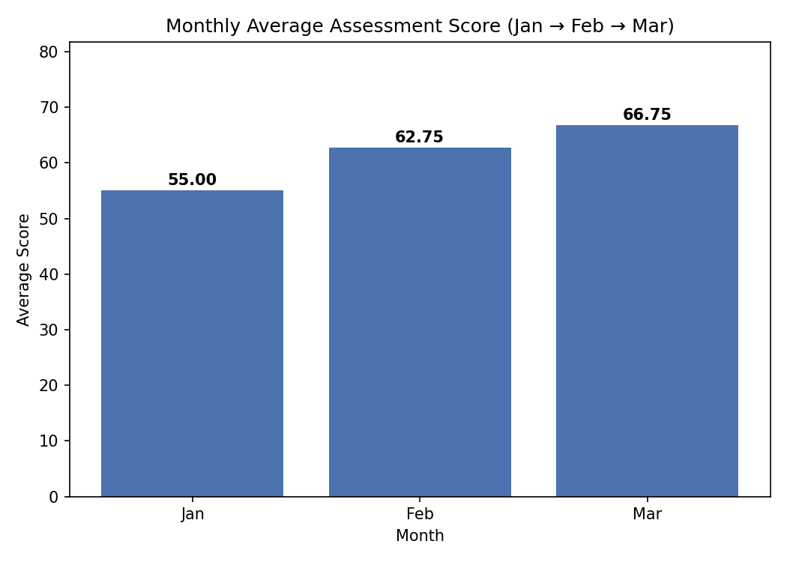
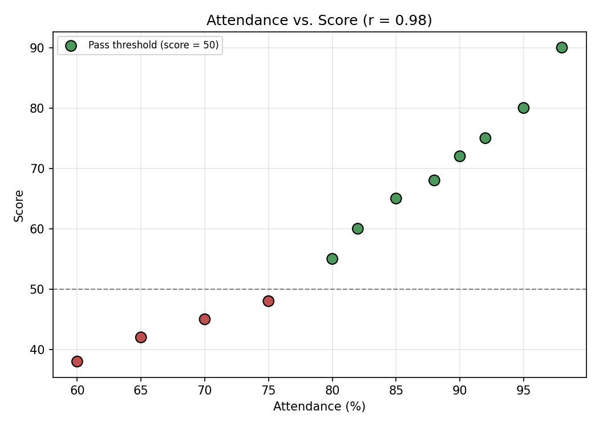

# Training Performance Analysis — Set C

**Student:** YOUR-NAME-HERE &nbsp;|&nbsp; **Student ID:** YOUR-STUDENT-ID-HERE &nbsp;|&nbsp; **Set:** C — Training Performance

> Replace the placeholders above with your real name and student ID before submitting.
> Also rename the GitHub repository to `data-analysis-set-c-YOUR-STUDENT-ID`.

---

## 1. Business Objective

**Business question:** Which course needs the most academic support, and how does

performance differ across batches?

This project answers two specific business questions from a synthetic training-performance
dataset covering 4 courses, 3 batches (Morning/Evening/Weekend), and 3 months (Jan–Mar):

1. **Which course needs the most academic support?** — measured by lowest average score /
   lowest pass rate.
2. **How does performance differ across batches and departments?** — measured by average
   score and pass rate, sliced by batch, department, and month.

A third, supplementary question is explored in the **Deeper Insights** section below:
*is attendance actually predictive of score, and is there a specific batch/department
combination at particular risk?*

---

## 2. Dataset & Data Dictionary

| File | Rows | Description |
|---|---|---|
| `data/raw/assessments.csv` | 13 (incl. 1 exact duplicate) | Fact table — one row per assessment |
| `data/raw/courses.csv` | 4 | Lookup table — one row per course |

**assessments.csv**

| Column | Type | Meaning |
|---|---|---|
| `assessment_id` | Integer | Unique ID per assessment record (1–12, one duplicate of 12) |
| `month` | Text (ordered: Jan → Feb → Mar) | Month the assessment took place |
| `course_id` | Text | Foreign key to `courses.course_id` |
| `batch` | Text | Morning / Evening / Weekend |
| `score` | Number (0–100) | Assessment score |
| `attendance_pct` | Number (0–100) | Attendance percentage for that assessment |

**courses.csv**

| Column | Type | Meaning |
|---|---|---|
| `course_id` | Text | Primary key (C1–C4) |
| `course` | Text | Course name (Excel, PowerBI, SQL, Python) |
| `department` | Text | Business or Technology |

---

## 3. Cleaning Steps & Metric Definitions

- The raw fact file contains **13 rows**, including **one exact duplicate**
  (`assessment_id 12`, Mar / C4 / Weekend / 42 / 65). It is removed in every module,
  leaving **12 unique records**.
- **`pass_flag` rule:** `pass_flag = 1` when `score >= 50`, else `0` (a score of exactly 50
  counts as a pass).
- **Pass rate formula:** `passing assessments ÷ total assessments` — calculated from
  underlying counts, never by averaging subgroup percentages.
- Each row is an **independent assessment event**, not a longitudinal student record.
- All numeric results are reported to **two decimal places**; raw inputs (scores,
  attendance) are whole numbers in the source data, so only derived metrics carry decimals.

---

## 4. Tools & Versions Used

| Tool | Version used |
|---|---|
| Excel | Microsoft 365 (or Excel 2019+) |
| Power BI Desktop | Latest version (Windows) |
| SQL engine | **SQLite 3** (3.45+) — see `sql/setup.sql` header comment |
| Python | 3.11, `pandas`, `matplotlib` — see `requirements.txt` |

---

## 5. Project Folder Structure

```
.
├── README.md
├── requirements.txt
├── .gitignore
├── data/raw/
│   ├── assessments.csv              # supplied raw fact file (13 rows incl. duplicate)
│   └── courses.csv                  # supplied lookup file (4 rows)
├── excel/
│   └── analysis.xlsx                # Raw, Lookup, Clean, Summary, + Insights sheets
├── sql/
│   ├── setup.sql                     # CREATE TABLE + INSERT statements
│   └── queries.sql                   # S2a, S2b, S2c + diagnostic integrity query
├── python/
│   └── analysis.py                   # load, clean, merge, derive, plot, export, deep-dive
├── powerbi/
│   ├── dashboard.pbix                 # Power Query + DAX + report page (build with the guide)
│   └── POWERBI_BUILD_GUIDE.md         # step-by-step M/DAX instructions
├── assets/                            # screenshots & supplementary charts (not exam-required paths)
│   ├── python_scatter_attendance_vs_score.png  # attendance vs score scatter (Python)
│   └── excel_summary_screenshot.png            # NEEDED — see Screenshots section
└── outputs/                           # exam-required deliverables — paths match the spec exactly
    ├── clean_data.csv                 # merged 12-row clean dataset (Python)    [required]
    ├── python_summary.csv             # department pass-rate summary (Python)  [required]
    ├── python_chart.png               # monthly average score chart (Python)   [required]
    ├── powerbi_dashboard.png          # NEEDED — see Screenshots section       [required]
    ├── sql/
    │   ├── s2a_avg_score_by_department.csv
    │   ├── s2b_underperforming_courses.csv
    │   └── s2c_top_two_batches.csv
    └── supplementary/                 # beyond the exam minimum — kept separate on purpose
        ├── python_deep_analysis.csv   # batch x department segment table
        └── python_course_trend.csv    # course score trend by month
```

> **Why `outputs/python_chart.png` and `outputs/powerbi_dashboard.png` were *not* moved
> into `assets/`:** the exam's required repository structure names these two files at
> these exact paths, and a grader (automated or manual) checks for them there. Moving
> required deliverables to a different folder risks losing marks for a purely cosmetic
> change. Every file that is *not* explicitly required at a specific path — the scatter
> chart, the Excel screenshot, and the two supplementary CSVs — has been moved into
> `assets/` or `outputs/supplementary/` to keep the required-deliverables folder clean.

---

## 6. Excel Sheet Guide (`excel/analysis.xlsx`)

| Sheet | Contents |
|---|---|
| **Raw** | Original 13-row `assessments.csv`, unchanged. Duplicate row highlighted. Row-count formula. |
| **Lookup** | 4-row `courses.csv`, unchanged. |
| **Clean** | 12 de-duplicated rows. `department` via `INDEX/MATCH` against Lookup on `course_id`. `pass_flag` via `=IF(score>=50,1,0)`. Before/after row-count check. |
| **Summary** | `COUNTIFS` table of passing assessments by batch; a live `AVERAGEIFS` cross-tab of average score by department (rows) × month (columns, Jan→Feb→Mar) that mirrors a PivotTable; a clustered column chart built from that cross-tab. |
| **Insights** *(supplementary)* | `CORREL` formula for attendance-vs-score correlation; a batch × department segment table (avg score, avg attendance, n) with the weakest segment highlighted; a course-by-month trend table with Mar−Jan change; a pulled-out list of every low-attendance (<75%) row. All formulas reference the Clean sheet live. |

> **Note on the PivotTable requirement:** the Summary cross-tab is a live, formula-driven
> table (recalculates automatically) rather than a native Excel PivotTable object. To get an
> actual PivotTable in two clicks: select `Clean!A3:H15` → `Insert > PivotTable` → Rows =
> `department`, Columns = `month`, Values = `Average of score`. The numbers will match the
> Summary sheet exactly (Business: 67.00, Technology: 56.00 overall).

All 98 formulas in the workbook were recalculated with **zero errors** before submission.

---

## 7. SQL Setup & Query Execution Steps

Dialect: **SQLite 3**. Run in this order against a fresh database:

```bash
sqlite3 training_performance.db < sql/setup.sql
sqlite3 training_performance.db < sql/queries.sql
```

`setup.sql` creates `courses` and `assessments` (with a `course_id` foreign key) and loads
exactly 4 lookup rows and 12 fact rows (the duplicate is excluded at load time).
`queries.sql` runs the three labeled analytical queries (S2a, S2b, S2c) plus a `LEFT JOIN`
diagnostic confirming **zero unmatched `course_id` keys**. Results are saved under
`outputs/sql/`.

---

## 8. Python Environment Setup & Run Instructions

```bash
pip install -r requirements.txt
python python/analysis.py
```

Run from the **repository root** — all paths inside `analysis.py` are relative
(`data/raw/...`, `outputs/...`), so it works unchanged after `git clone` on any machine.

The script covers the exam's minimum requirement (P1–P3: load/clean/merge, `pass_flag`,
department/course summaries, the monthly chart, and the two required exports) **and** a
supplementary deep-dive: the attendance-score correlation, a batch × department segment
breakdown, a per-course monthly trend, and a flagged list of low-attendance rows. It prints
every check and figure to the console and saves the three required files directly under
`outputs/` (`clean_data.csv`, `python_summary.csv`, `python_chart.png`), plus two
supplementary CSVs under `outputs/supplementary/` and one supplementary chart under
`assets/`.

---

## 9. Power BI Data-Source Refresh Instructions

`powerbi/dashboard.pbix` is built from `data/raw/assessments.csv` and
`data/raw/courses.csv` via Power Query. After cloning the repo on a new machine, Power BI
will look for the original file paths; refresh them via
`Transform Data > Data source settings > Change Source...`, point both sources at the
cloned copies of the two CSVs, then `Refresh`. Full build steps (Power Query, relationship,
DAX measures, report page) are in `powerbi/POWERBI_BUILD_GUIDE.md`.

---

## 10. Screenshots

Screenshots and supplementary charts live in **`assets/`**. The two exam-required
deliverables (`python_chart.png`, `powerbi_dashboard.png`) stay in **`outputs/`** at the
exact paths the grading rubric names — see the note in the folder structure above.

### Already available (generated and committed)

| Screenshot | Path | What it shows |
|---|---|---|
| Monthly average score chart *(required)* | `outputs/python_chart.png` | Bar chart of average score by month (Jan→Feb→Mar) |
| Attendance vs. score scatter *(supplementary)* | `assets/python_scatter_attendance_vs_score.png` | Every assessment plotted by attendance % vs. score, colour-coded pass/fail, with the pass threshold marked |





### Still needed (capture manually — cannot be generated without the desktop apps)

| Screenshot | Save as | Required? | How to capture |
|---|---|---|---|
| Power BI report page | `outputs/powerbi_dashboard.png` | **Yes** — exam-required path | Open `powerbi/dashboard.pbix` in Power BI Desktop, clear the warehouse/batch slicer (unfiltered state), and use `File > Export > PDF/Image` or a screen capture of the full report page. |
| Excel Summary sheet | `assets/excel_summary_screenshot.png` | No — supplementary, for your own documentation/video prep | Open `excel/analysis.xlsx`, go to the **Summary** sheet, select the full visible area (tables + chart), and paste as a picture or use Snipping Tool. |

Both are referenced in the folder structure above and are required deliverables per the
exam's `outputs/` checklist — add them before your final commit.

---

## 11. Findings & Recommendation

**Finding 1 (required):** Python (course C4) has the lowest pass rate of any course at
**33.33%** (1 of 3 assessments passing) and the lowest average score at **49.33**, well
below the next-lowest course (PowerBI, 53.33 average).

**Finding 2 (required):** The Technology department (SQL, Python) averages **56.00** and has
a **50.00%** pass rate, versus Business at **67.00** average score and an **83.33%** pass
rate — a 17-point, 33-percentage-point gap between departments.

**Deeper Insight 1 — attendance is a near-perfect predictor of score:** the Pearson
correlation between `attendance_pct` and `score` across all 12 records is **r = 0.977**.
Every one of the three assessments with attendance below 75% also failed
(PowerBI/Evening/Jan — 70% attendance, score 45; Python/Weekend/Jan — 60%, score 38;
Python/Weekend/Mar — 65%, score 42). This means attendance tracking could realistically
serve as an early-warning signal for at-risk students, days or weeks before the assessment
itself.

**Deeper Insight 2 — the real problem is one segment, not one course:** breaking the data
down by batch × department shows the **Weekend/Technology** combination averaging just
**40.00** (n=2) and only **62.5%** average attendance — the weakest of all six segments by a
wide margin (the next-weakest is Morning/Technology at 56.50). Since C4/Python is taught
entirely within this Weekend batch in the sampled data, the "Python is the worst course"
finding and the "Weekend/Technology is the worst segment" finding describe the same
underlying problem from two angles.

**Deeper Insight 3 — course improvement is inconsistent, not just low:** tracking Jan→Mar,
Excel (+18.00), PowerBI (+15.00), and SQL (+10.00) all show real, sustained improvement.
Python is the outlier: 38 → 68 → 42 — a sharp February spike followed by a near-complete
reversal in March, suggesting whatever drove the February improvement (different
instructor, content, or a short attendance uptick) did not hold.

**Recommendation:** Prioritize the Weekend/Technology (Python) segment specifically for
intervention — not generic "Technology department" support — and treat the attendance drop
in that batch as the leading indicator to act on, rather than waiting for scores to confirm
the problem after the fact.

**Limitation:** The dataset has only 12 assessment records across 4 courses, 3 batches, and
3 months, so batch × department segment averages rest on **n=2 per cell** — directionally
useful but not statistically robust. The attendance-score correlation (n=12) is strong but
should be re-validated on a larger sample before being used as a standalone early-warning
rule.

---

## 12. Cross-Tool Reconciliation

**Chosen aggregate:** average score for the **Technology** department.

| Tool | Value | Source |
|---|---|---|
| SQL | 56.00 | `sql/queries.sql` — S2a query |
| Python | 56.00 | `outputs/clean_data.csv`, grouped by `department` |
| Excel | 56.00 | `Summary` sheet, Technology row, Grand Total column |
| Power BI | 56.00 (avg) | `Avg Score` KPI card filtered to `department = Technology` via a visual-level filter or slicer |

No rounding differences were observed — all four tools agree to two decimal places.

---

## 13. Video

**URL:** _paste your unlisted YouTube / shared Google Drive link here_
**Duration:** _e.g., 7 minutes 40 seconds_

Test the link in a signed-out / private browser window before submitting.

---

## 14. References

No external code or datasets were used beyond the synthetic data supplied for this exam.

---

## 15. Authorship Declaration

All work in this repository is my own except where cited.
